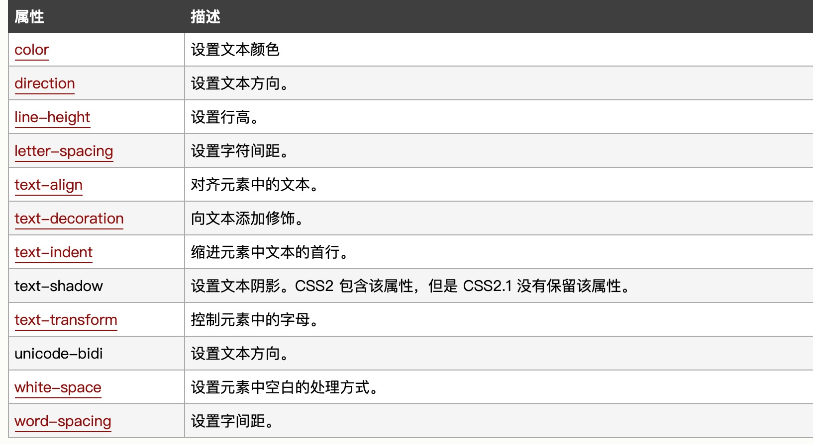

# css基础

## css介绍
    1.概述：层叠样式表
    2.完善UI
## css 基础语法 🌰：./CssDemo/Concept/MyCss.css
>```
> selector {
>    property: value
> }
>```
> 属性大于1个之后，属性之间用分号隔开，
> 如果值大于一个单词，则需要加上引号：
>```css
> eg. h1 {color:red;font-size:14px;}
> p {font-fmaily:"sans serif";}
>```

## css 高级语法 🌰：./CssDemo/Concept/index.html;MyCss.css
    1.选择器的分组：
>```css      
> h1,h2,h3,h4,h5,h6{cloor:red;}
>```
    2.继承
>```css
> body{
>    color:green;
>}
>```

## css基础 - 派生选择器 🌰：./CssDemo/Concept/index.html;MyCss.css
    概念：根据元素在其位置的上下文关系来定义样式 
## css - id选择器 🌰：./CssDemo/Concept/index.html;MyCss.css
    1.ID选择器可以为表有id的html元素制定特定的样式
    2.id选择器与"#"来定义
    3.id选择器和派生选择器：
        目前比较常用的方式时id选择器，用于建立派生选择器
## 类选择器 🌰：./CssDemo/Concept/index.html;MyCss.css
    1.是一个点"."显示
    2.class也可以用作派生选择器
## 属性选择器 🌰：./CssDemo/Concept/index.html;MyCss.css
    1.对带有指定属性的HTML元素设置样式
    2.属性和值选择器
## css样式(1)
    1.背景 🌰：./CssStyle/index.html;Back*.css
        允许使用纯色作为背景，也允许使用背景图像创建相当复杂的效果
        *背景属性：
        属性                           描述
        background-attachment         背景图像是否固定或这锁着页面的其余部分滚动
        background-color              设置元素的背景颜色  
        background-image              把图片设置为背景
        background-position           设置背景图片的其实位置
        background-repeat             设置背景图片是否以及如何重复
        background-size               规定背景的图片尺寸
        background-origin             规定背景图片的定位区域
        background-clip               规定背景的绘制区域

    2.文本 🌰：./CssStyle/TextDemo.html;TextStyle.css
        文本属性可定义文本外观
        通过文本属性，可改变文本的颜色、字符间距，对齐文本、装饰文本、对文本缩进

##  css样式(2)
    1.字体 🌰：./CssStyle/FontDemo.html;FontStyle.css
        css字体属性定义文本的字体系列、大小、加粗、风格和变形
        *属性                      描述
        font-family             设置字体系列
        font-size               设置字体尺寸
        font-style              设置字体风格
        font-variant            以小型大写字体或正常字体显示文本
        font-weight             设置字体的粗细

    2.链接： 🌰：./CssStyle/LinkDemo.html;LinkStyle.css
        *四种状态
        a:link  普通的、未被访问链接
        a:visited   用户已访问的链接
        a:hover 鼠标指针位于链接的上方
        a:active   链接被点击的时刻

        *常见的连接方式
            text-decoration属性大多用于去掉链接中的下划线

        *背景颜色 
            background-color

    3.列表 🌰：./CssStyle/ListDemo.html;ListStyle.css
        列表属性允许你放置、改变列表标志，或者将图像作为列表项标志
        *属性                   描述
        list-style              简写列表项
        list-style-image        列表项图像
        list-style-position     列表标志位置
        list-style-type         列表类型
    4.表格 🌰：./CssStyle/TableDemo.html;TableStyle.css
        表格属性可以改变表格的外观
        *表格边框
        *折叠边框
        *表格宽高
        *表格文本对齐
        *表格内边距
        *表格颜色
    5.轮廓